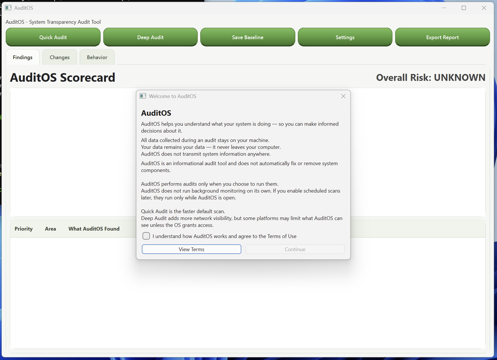
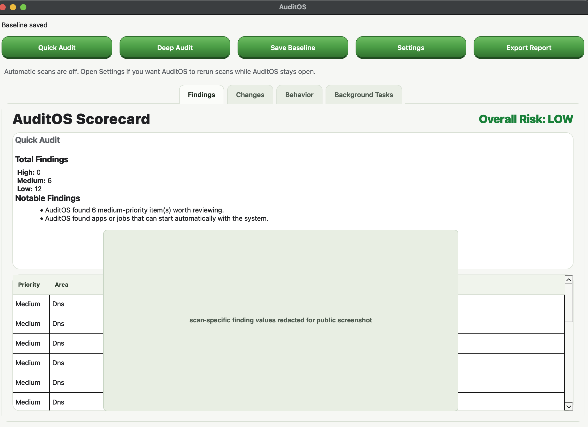
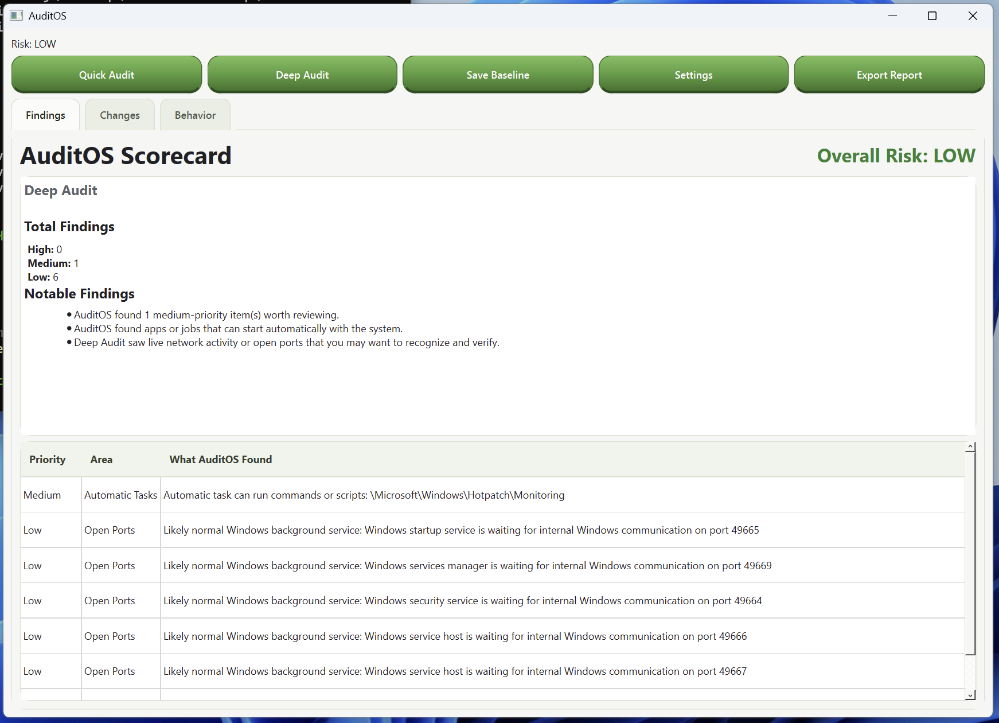

# AuditOS

AuditOS helps you see what is starting, running, and changing on your computer in one place.

It focuses on startup items, browser extensions and related background browser activity, scheduled tasks, and network-related system activity. AuditOS presents that information in plainer, more organized terms so you can better understand what deserves attention and make more informed decisions about what may no longer be necessary.

That gives you a clearer view of what is running, what has changed over time, and what may be worth investigating, keeping, disabling, or removing outside the app using the tools you already trust.

AuditOS is a local desktop auditing tool for macOS and Windows. Audit data stays on your machine, and the app does not automatically remove, disable, or change system components.

The project is currently in beta. The focus right now is stability, clearer reporting, and making the app easy to test on macOS and Windows.

## Get The Beta

- Download the latest beta build from [GitHub Releases](https://github.com/tracedowney/AuditOS--Desktop/releases)
- Use `Quick Audit` for a fast first pass
- Use `Deep Audit` when you want extra network and routing visibility

## Screenshots

A few snapshots from the current beta:

<p align="center">
  
  
</p>

<p align="center">
  
</p>

## Give Feedback

- Report a bug: [Open a bug report](https://github.com/tracedowney/AuditOS--Desktop/issues/new?template=bug_report.md)
- Suggest an improvement: [Open a feature request](https://github.com/tracedowney/AuditOS--Desktop/issues/new?template=feature_request.md)
- For security-sensitive reports, follow [SECURITY.md](SECURITY.md)

When reporting an issue, include your platform, whether you ran Quick or Deep Audit, screenshots when possible, and an exported report JSON if you have one.

## What AuditOS Does

- Runs local audits of browser extensions, proxy settings, DNS settings, startup items, scheduled tasks, live background tasks, certificates, and network-related system state
- Supports a faster `Quick Audit` for common checks
- Supports a broader `Deep Audit` for additional background-task, connection, listening-port, and routing visibility
- Lets you save a baseline and compare later scans
- Tracks behavior changes between scans so testers can spot what changed over time

## Core Principles

- All audits run locally on your machine
- Your data does not leave your computer
- AuditOS does not automatically remove, disable, or change system components
- AuditOS is an informational tool, not an automated remediation tool
- AuditOS helps surface unfamiliar or changed system state; it does not claim to fully diagnose every process or startup item
- Optional scheduled scans only run while AuditOS is open during this beta

## Audit Modes

### Quick Audit

Use `Quick Audit` for a fast snapshot of higher-level browser and system configuration checks. This is the best default option for routine testing.

Quick Audit currently focuses on:

- Browser extensions
- Proxy settings
- DNS settings
- Network interfaces
- Startup items
- Scheduled tasks
- Certificates

### Deep Audit

Use `Deep Audit` when you want additional visibility into live network behavior and background activity that deserves verification.

Deep Audit includes everything in Quick Audit, plus:

- Running background tasks with plain-English process explanations
- Active network connections
- Listening ports
- Routes / default routes

On macOS, parts of Deep Audit may show limited visibility if the OS denies process or socket enumeration. AuditOS should report that limitation instead of crashing.

## Current Beta Scope

AuditOS is still in the stabilization phase. Expect:

- rough edges in cross-platform coverage
- some findings that still need tuning for signal quality
- packaging and release flow updates while the project hardens

## Installation

### macOS

1. Download the current macOS beta zip.
2. Unzip it.
3. Open `AuditOS.app`.
4. If Gatekeeper blocks the app, right click `AuditOS.app`, choose `Open`, then confirm.

### Windows

1. Download the current Windows beta zip.
2. Unzip it fully before launching.
3. Open `AuditOS.exe`.
4. If SmartScreen appears, choose `More info`, then `Run anyway`.

## What Testers Should Watch For

- crashes or hangs during Quick or Deep audit
- sections that appear empty when they should contain data
- findings that seem obviously incorrect or overly noisy
- inconsistencies between repeated scans on the same machine
- baseline or change-detection results that do not match expectations

## Reporting Feedback

When reporting an issue, include:

- operating system and version
- whether you ran Quick Audit or Deep Audit
- what you expected to happen
- what actually happened
- screenshots or exported report JSON if helpful

If the issue is security-sensitive, please use the process in [SECURITY.md](SECURITY.md).

## Development

### Requirements

- Python 3.9+
- `PySide6`
- `psutil`

Install runtime dependencies with:

```bash
python3 -m pip install -r requirements.txt
```

Install development dependencies with:

```bash
python3 -m pip install -r requirements.txt -r requirements-dev.txt
```

### Run Locally

From the repo root:

```bash
cd app
PYTHONPATH="$(pwd)/.." python3 main.py
```

On Windows PowerShell:

```powershell
cd app
$env:PYTHONPATH = (Resolve-Path "..").Path
python main.py
```

### Run Tests

If you use the repo-local `venv`, run:

```bash
./scripts/test.sh
```

If you are using another Python environment, install `requirements-dev.txt` there first and then run:

```bash
python3 -m pytest -q
```

### Build Releases

The repo includes a PyInstaller spec and a PowerShell release script:

- [AuditOS.spec](AuditOS.spec)
- [scripts/build_release.ps1](scripts/build_release.ps1)
- [docs/release-checklist.md](docs/release-checklist.md)

Run `pwsh -File ./scripts/build_release.ps1` to package a beta build. The script now derives the archive version from `app/version_info.py` unless you intentionally override it with `-Version`.

Use the release checklist to keep macOS and Windows beta artifacts aligned to the same commit and to smoke test the packaged app before upload.

For repeatable beta releases, the repo also includes a tag-driven GitHub Actions workflow that can build macOS and Windows artifacts from the same `v*-beta` tag and publish them to the matching pre-release.

## Project Docs

- [CHANGELOG.md](CHANGELOG.md)
- [CONTRIBUTING.md](CONTRIBUTING.md)
- [SECURITY.md](SECURITY.md)
- [NOTICE](NOTICE)
- [PRIVACY](PRIVACY)
- [docs/release-checklist.md](docs/release-checklist.md)
- [docs/objectives.md](docs/objectives.md)
- [docs/parking-lot.md](docs/parking-lot.md)

## License

Copyright © 2026 AuditOS
